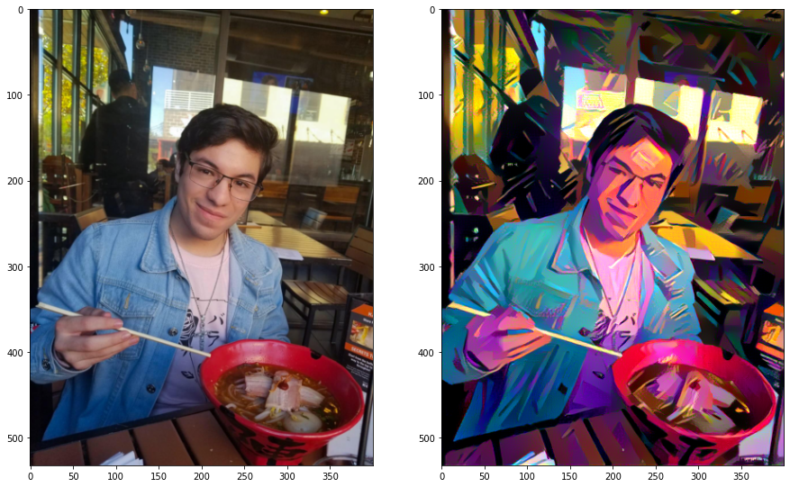

# ML_Projects
This is my personal repository where I upload projects and assignments that I have worked on.

Format: 

# Folder Descriptions
**datasets:** stores the datasets that I used for each project

**sklearn:** stores my projects/assignments where I used the sklearn library

**pytorch:** stores my projects/assignments where I used the pytorch library

**tensorflow:** stores my projects/assignments where I used the tensorflow library

**udacity:** stores the projects/assignments that I have worked on for my nanodegree

